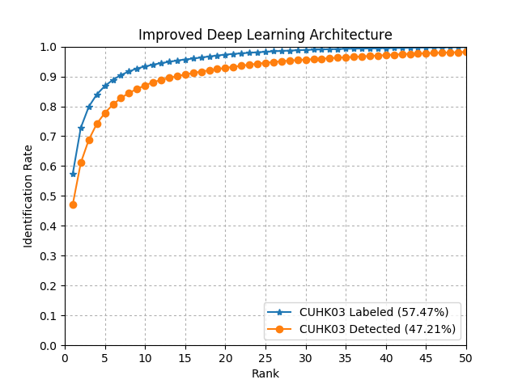

Improved Deep Learning Architecture for Person Re-Identification
================================================================

This repository implements the network described in [An Improved Deep Learning Architecture for Person Re-Identification by Ahmed et al](http://www.cv-foundation.org/openaccess/content_cvpr_2015/papers/Ahmed_An_Improved_Deep_2015_CVPR_paper.pdf). The main deep learning library used to do this is the [*dlib* machine learning library](http://dlib.net/).

Installation
------------

This code has only been built and tested on *Ubuntu 16.04*.

- **dlib** *v19.0+*
  - **Requirements:**
      - `C++11`-compatible compiler
      - `CUDA 7.5` or greater
      - `cuDNN v5` or greater
- **CMake** *v2.6+*
- **HDF5** *v1.8.16+*
  - Used for loading the `CUHK03` dataset from a *MATLAB* `mat` file.

The build is managed using *CMake*. In order to build this code, open a terminal and enter the following commands.

``` bash
cd $THIS_REPOSITORY

mkdir build
cd build

cmake -DDLIR_DIR=$PATH_TO_DLIB ..
# ccmake . # Set BUILD_TEST to ON for unit testing. dlib flags can also be set here.

make && make install
```

`$PATH_TO_DLIB` represents the path to the *dlib* library directory.

Details
-------

#### Pre-processing

Global contrast normalization is applied to each image at the input layer.

#### Architecture Modifications

- Each `5x5` convolutional layer, except for the "patch summary features" layer,  has been replaced by two `3x3` convolutional layers, with batch normalization after each.
- Batch normalization was added after the fully connected layer.

#### Training Modifications

- Minibatches consist of 128 image pairs, with an even split between positive and negative examples.
- No hard negative and data augmentation were used for training.

Results
-------

Below is a cumulative match curve (CMC) produced by the network implemented in this repository. The criteria uses the evaluation as described [here](https://github.com/Cysu/dgd_person_reid/blob/master/utils/cmc.py) (repository for Domain Guided Dropout for Person Re-ID).

Currently, only `CUHK03` training and testing has been implemented (in `cuhk03.cpp`).

<div style="text-align:center"></div>
