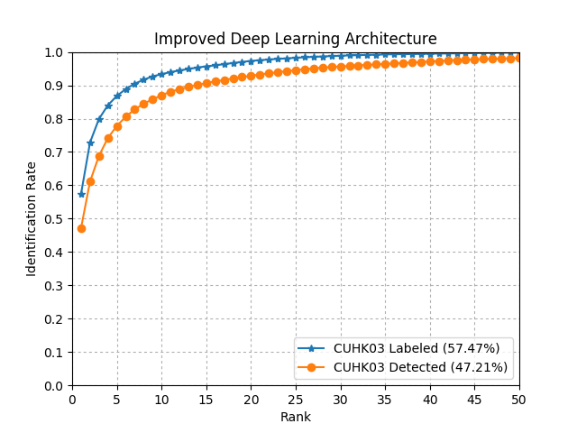

Improved Deep Learning Architecture for Person Re-Identification
================================================================

This repository implements the network described in [An Improved Deep Learning Architecture for Person Re-Identification by Ahmed et al](http://www.cv-foundation.org/openaccess/content_cvpr_2015/papers/Ahmed_An_Improved_Deep_2015_CVPR_paper.pdf). The main deep learning library used to do this is the [*dlib* machine learning library](http://dlib.net/).

Installation
------------

### Requirements
- **dlib** *v20.0+*
- **CMake** *v3.13+*
- **HDF5** *v1.10+*
- **OpenBLAS**
- **C++17**-compatible compiler

### Build Instructions

```bash
mkdir build
cd build
cmake .. -DBUILD_TEST=ON
make -j$(nproc)
```

Docker Environments
-------------------

Two Docker environments are provided in the `docker/` directory:

1.  **`Dockerfile.ci`**: A slim, CPU-only environment used for Continuous Integration and unit testing.
2.  **`Dockerfile.train`**: A GPU-accelerated environment optimized for NVIDIA hardware.

### GPU Training with Docker

To build the training image optimized for your GPU (default is RTX 3080, `sm_86`):

```bash
docker build -t idla-train -f docker/Dockerfile.train --build-arg GPU_ARCH=86 .
```

To run training on the CUHK03 dataset:

```bash
docker run --gpus all -it --rm \
    -v /path/to/cuhk03_data:/data \
    -v $(pwd):/results \
    -w /results \
    idla-train -i /data
```

**Note:** The app expects `cuhk-03.mat` to be inside the mounted `/data` directory.

Usage
-----

The primary training script is `run_cuhk03`.

```bash
./run_cuhk03 -i /path/to/dataset/directory [--detected]
```

### Outputs
- `cuhk03_[labeled|detected]_modidla.dat`: Checkpoint file (resumable).
- `cuhk03_[labeled|detected]_modidla.dnn`: Final trained model.
- `cmc_cuhk03_[labeled|detected]_modidla.csv`: Cumulative Match Curve results.

Details
-------

#### Pre-processing
Global contrast normalization is applied to each image at the input layer.

#### Architecture Modifications
- Each `5x5` convolutional layer, except for the "patch summary features" layer, has been replaced by two `3x3` convolutional layers, with batch normalization after each.
- Batch normalization was added after the fully connected layer.

#### Training Modifications
- Minibatches consist of 128 image pairs, with an even split between positive and negative examples.
- No hard negative and data augmentation were used for training.

Results
-------

Below is a cumulative match curve (CMC) produced by the network implemented in this repository.

<div style="text-align:center"></div>
